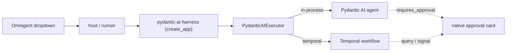

# omnigent-pydantic-ai

Run [Pydantic AI](https://ai.pydantic.dev) agents inside [Omnigent](https://github.com/omnigent-ai/omnigent) — in the dropdown, on a host, with native human-in-the-loop approval. The same agent runs in-process or durably on Temporal. Omnigent ships no Pydantic AI harness; `omnigent_pydantic_ai/` is one.



On an approval-gated tool the agent returns `DeferredToolRequests`; the executor raises a native Omnigent card and resumes on the verdict.

## Define an agent

A normal Pydantic AI agent plus an Omnigent spec that selects the harness:

- `examples/agent.py` — gate tools with `@agent.tool(requires_approval=True)` and `output_type=[str, DeferredToolRequests]`.
- `examples/config.yaml` — `executor: {type: omnigent, config: {harness: pydantic-ai}}`. A dir with `config.yaml` at its root is the agent bundle, so `--agent examples` registers it.

The harness loads `$PYDANTIC_AI_AGENT` (default `examples.agent:agent`); `$PYDANTIC_AI_EXECUTION` picks `in_process` (default) or `temporal`.

## Run

```sh
gcloud auth application-default login    # once, for Vertex
uv sync && source scripts/env.sh
python scripts/patch_omnigent.py         # register the harness (idempotent)

omnigent server -p 6868 --agent examples &
omnigent host --server http://localhost:6868 &
# open http://localhost:6868 → review-agent → message it → approve the commit card
```

REPL instead of the UI: `omnigent run examples -p "Reconcile batch #42 and commit it."`

Durable on Temporal (output arrives at turn boundaries — Temporal buffers streaming):

```sh
temporal server start-dev --port 7349 --namespace hitl &
python -m omnigent_pydantic_ai.temporal &      # worker
PYDANTIC_AI_EXECUTION=temporal omnigent run examples -p "..."
```

Test: `uv run python tests/test_harness_hitl.py`

## Open problem: durable environment

We have durable execution (Temporal), durable session + context (Omnigent), and
fork. We do **not** have a durable *environment* — the working dir/sandbox the
agent builds (cloned repo, edits, processes) lives on the worker/runner and is
lost when it's reclaimed. So follow-ups that need prior filesystem state don't
just work. The shape of the fix: **Temporal owns execution durability; a host or
session-scoped volume owns workspace durability.** Pin a session to the host
that holds its workspace so "continue" stays stateful; "fork" is fresh by
default (optionally a cheap git-worktree copy if you want stateful forks).

## Patches to Omnigent

Omnigent 0.1.x has no harness plugin point, so `scripts/patch_omnigent.py` adds `pydantic-ai` to two allowlists (`_HARNESS_MODULES`, `OMNIGENT_HARNESSES`). One more rough edge is handled in `harness.py`: Omnigent forwards approvals as `{type, data:{...}}` but the harness scaffold wants those fields flat (else it 422s and the turn hangs), so a small ASGI middleware flattens them. Clean upstream fixes: a plugin entry point, and forwarding flat or accepting the envelope.
